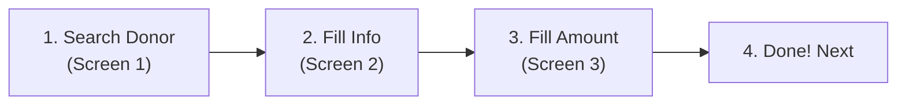
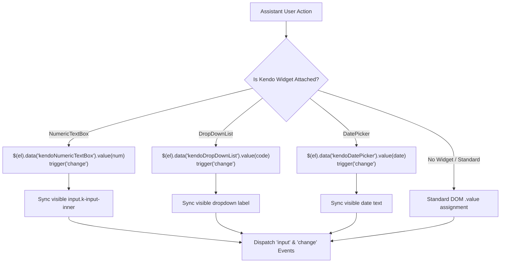

# NetFile ActBlue Assistant

> **Save hours of manual data entry.** An easy browser companion that helps campaign treasurers and compliance staff enter ActBlue contributions and payment processing fees into **NetFile Campaign Disclosure** for California FPPC Form 460 filings.

---

## What is This?

When filing campaign disclosure reports (California FPPC Form 460), campaign treasurers must manually transfer hundreds of online donations from ActBlue into NetFile. NetFile requires jumping between several screens for every single donor: searching for existing records, creating new individuals, entering contribution amounts, and recording merchant processing fees.

**NetFile ActBlue Assistant** is a small browser add-on that floats in the corner of your NetFile screen. It reads your downloaded ActBlue spreadsheet and adds convenient **1-click fill buttons** to NetFile's forms as you navigate through each step.

- ⚡ **No more copy-pasting**: Pre-fills donor names, addresses, employers, occupations, dates, and contribution amounts with one click.
- 💳 **Handles fees automatically**: Calculates Stripe and ActBlue merchant processing fees, groups them by payout batch to match your bank deposits, and classifies them correctly under FPPC code **`WEB`**.
- 🔒 **100% Private & Secure**: Runs entirely inside your browser. Your donor spreadsheet is never sent to any server, cloud service, or third party.
- 📌 **Stays out of your way**: Draggable, minimizable, and remembers which entries you've already completed.

---

## Quick Start (3-Minute Setup)

You don't need any programming tools or technical skills to use this assistant. All you need is the free **Tampermonkey** browser extension.

### Step 1: Install Tampermonkey
Install the free Tampermonkey extension for your browser:
- [Tampermonkey for Google Chrome](https://chromewebstore.google.com/detail/tampermonkey/dhdgffkkebhmkfjojejmpbldmpobfkfo)
- [Tampermonkey for Mozilla Firefox](https://addons.mozilla.org/en-US/firefox/addon/tampermonkey/)
- [Tampermonkey for Brave / Microsoft Edge](https://microsoftedge.microsoft.com/addons/detail/tampermonkey/iikmkjmpaadaobahmlepeloendndfphd)

### Step 2: Add the Assistant Script
1. Open [`dist/netfile-userscript.user.js`](dist/netfile-userscript.user.js) on your computer (or copy its full text), or  [install via Tampermonkey](https://raw.githubusercontent.com/castorf/netfile-actblue-assistant/main/dist/netfile-userscript.user.js)
2. Click the **Tampermonkey icon** in your browser toolbar $\rightarrow$ click **Dashboard**.
3. Go to the **Utilities** tab, find **Install from file**, and select `dist/netfile-userscript.user.js` *(or click the `+` tab and paste the text, then click File $\rightarrow$ Save)*.
4. Click **Install**.

### Step 3: Open NetFile & Start!
Log into your NetFile filer account:
`https://netfile.com/Filer/LegacyFree/`

The dark-mode **ActBlue Assistant** panel will appear in the top-right corner of your screen!

---

## How to Use It (Step-by-Step Guide)

### 1. Load Your ActBlue Spreadsheet
1. Download your contribution export CSV from your ActBlue dashboard.
2. In NetFile, look at the Assistant panel and click **📁 Upload CSV**.
3. Select your downloaded ActBlue CSV file.
4. The panel will show the first donor's name, amount, date, and fee breakdown.

> [!NOTE]
> **Privacy Guarantee**: Your file is read locally on your computer and stored in your browser's private storage. No data ever leaves your computer.

---

### 2. Entering Contributions (Schedule A)

For each contribution in your list:



1. In NetFile, navigate to **Contributions** $\rightarrow$ **Add Monetary Contribution**.
2. **Screen 1 (Search for Entity)**:
   - Click the green button: **⚡ Search [Donor Name]**.
   - NetFile will search for that person.
   - **If the donor already exists**: Click **Select** next to their name.
   - **If the donor is new**: Click the green button: **⚡ Create Individual**.
3. **Screen 2 (Add a New Individual)**:
   - Click the green button: **⚡ Fill Donor Info**.
   - All fields (First/Last name, Street address, City, State, Zip, Employer, Occupation, Email, Phone) are instantly filled in.
   - Click NetFile's red **Save** button.
4. **Screen 3 (Enter a Monetary Contribution)**:
   - Click the green button: **⚡ Fill Contribution ($XX)**.
   - NetFile's Date and Gross Amount are filled in.
   - Review and click NetFile's red **Save** button.
5. In the assistant panel, click **Mark as Entered** and proceed to the next donor!

---

### 3. Entering Processing Fees (Schedule E Disbursements)

FPPC rules require reporting credit card processing fees as campaign expenditures (disbursements). The assistant gives you two easy options:

#### Option A: Payout Batches (Recommended for High Volume)
When ActBlue sends funds to your campaign bank account, it bundles several donations together and deducts the fees.
1. Click the **Payout Batches** tab at the top of the assistant panel.
2. You'll see a clean table grouping your donations by **Payout Date** with the total fees withheld.
3. In NetFile, go to **Disbursements** $\rightarrow$ **Add Disbursement** and choose your payee (e.g. *Stripe, Inc.* or *ActBlue Technical Services*).
4. On the **Enter a Disbursement** screen, click **Fill** next to the matching payout date in the table.
5. The assistant automatically sets:
   - **Date**: Payout settlement date.
   - **Amount**: Total processing fee amount.
   - **Expenditure Type**: Automatically selects **`WEB`** (*Information Technology Costs*).
   - **Description**: `ActBlue/Stripe fees for payout batch (X txns)`.
6. Click NetFile's red **Save** button.

#### Option B: Per-Transaction Fees
If you prefer to itemize fees for each individual contribution:
1. When on NetFile's **Enter a Disbursement** screen, the assistant's green button changes to **⚡ Fill Total Fee ($XX)**.
2. Click it to populate the Date, Amount, `WEB` code, and description: `ActBlue/Stripe processing fee (Donor Name)`.
3. Click NetFile's red **Save** button.

---

### Handy Tips & Shortcuts

- **1-Click Field Copy**: Need to copy just one field? Click on any text inside the assistant card (like Employer or Address) to immediately copy it to your clipboard.
- **Move Out of the Way**: Click and drag the top header bar to move the assistant anywhere on your screen.
- **Minimize**: Click the **`_`** button in the header to minimize the panel to a tiny badge when you need to see behind it.
- **Progress Tracking**: Completed records are saved with a checkmark so you never lose your place if you take a break or close the browser tab.

---

## Frequently Asked Questions (FAQ)

<details>
<summary><b>Is my donor data safe and private?</b></summary>

**Yes, completely.** The script does not contain any tracking, analytics, or external connections. It operates under strict security permissions (`@grant none`) and processes your spreadsheet entirely within your computer's browser memory.
</details>

<details>
<summary><b>Why does the assistant categorize fees as "WEB"?</b></summary>

Under California FPPC Form 460 guidelines, **`WEB`** stands for *"Information technology costs (internet, e-mail)"*. Because ActBlue and Stripe provide web-based donation processing and payment gateway infrastructure, California campaign treasurers customarily classify online transaction fees under `WEB` (with a clear notation in the description).
</details>

<details>
<summary><b>What if NetFile already has this donor on file?</b></summary>

When you click **⚡ Search [Donor Name]**, NetFile displays any existing matches. If the donor already exists, simply click **Select** next to their row in NetFile. You skip the "Add Individual" screen and jump straight to entering the contribution!
</details>

<details>
<summary><b>Can I close my browser and finish later?</b></summary>

Yes. Your uploaded records and your "Entered" checkmarks are saved in your browser's local storage. When you return to NetFile on the same computer, your progress will be waiting for you.
</details>

---

# Technical Details & Developer Guide

*The following sections are intended for developers, technical compliance staff, or anyone wanting to build, inspect, or modify the source code.*

---

## Theory of Operation & Architecture

### 1. Kendo UI Widget Automation vs. Standard DOM
NetFile is an ASP.NET MVC application that wraps standard form controls inside **Telerik / Kendo UI** widgets.

- **The Challenge**:
  NetFile's `#Amount` input is wrapped in a Kendo `NumericTextBox`. Kendo hides the real `<input id="Amount">` (`style="display: none;"`) and generates a visible companion input: `<input class="k-input-inner" role="spinbutton">`.
  
  Setting `input.value = "100.00"` via standard DOM APIs modifies only the hidden backing element; the visible input remains blank and Kendo's internal state is not updated.
  
- **How We Solve It ([`src/netfile/actions.ts`](src/netfile/actions.ts))**:
  `setKendoOrStandardValue(el, val)` directly addresses NetFile's framework:
  1. Accesses the Kendo instance via jQuery: `$(el).data('kendoNumericTextBox').value(num)` and triggers the change event.
  2. Directly synchronizes the visible `input.k-input-inner` element and fires synthetic `input` and `change` events.
  3. Uses `$(el).data('kendoDropDownList').value('WEB')` for the expenditure dropdown and `$(el).data('kendoDatePicker')` for date pickers.



### 2. Multi-Frame & Modal Iframe Sandboxing
When creating an organization, NetFile renders the form inside an embedded iframe modal (`_Modal_OrgAdd`).

- **Duplicate Injection Prevention**: By default, userscripts inject into every frame matching the URL pattern. We prevent duplicate widgets from covering the modal by setting `noframes: true` in `vite.config.ts` and adding `if (window !== window.top) return;` in `main.tsx`.
- **Cross-Frame DOM Access**: The top-level assistant uses `getElement(id)` to inspect the top document and all child `iframe.contentDocument` trees, allowing the single top-level widget to fill modal fields smoothly.

### 3. Screen Detection State Machine
[`src/netfile/screenDetector.ts`](src/netfile/screenDetector.ts) uses reactive URL and DOM matching to determine NetFile's current screen:

| Screen State | NetFile URL / DOM Selector | Dynamic Action Button |
|---|---|---|
| `SelectEntity` | `.../Entity/SelectEntity*` | ⚡ Search Donor & ⚡ Create Individual |
| `PeopleAdd` | `.../Entity/PeopleAdd*` | ⚡ Fill Donor Info |
| `OrgAdd` | `#_Modal_OrgAdd` modal visible | ⚡ Fill Org Info |
| `TransactionAddContribution` | `.../TransactionAdd?TT=MonetaryContribution*` | ⚡ Fill Contribution ($XX) |
| `TransactionAddDisbursement` | `.../Disbursement?TT=Disbursements*` | ⚡ Fill Total Fee ($XX) |

---

## Developer Setup & Building from Source

This project uses **[Bun](https://bun.sh)** for rapid builds and package management.

### Prerequisites
- [Bun runtime](https://bun.sh) (`curl -fsSL https://bun.sh/install | bash`)
- Google Chrome, Firefox, or Brave with Tampermonkey

### Development with Hot Reload (HMR)
```bash
# 1. Clone the repository
cd netfile-userscript

# 2. Install dependencies
bun install

# 3. Start the Vite development server
bun run dev
```
Vite will output a local URL (e.g. `http://localhost:5173/@vite-plugin-monkey/netfile-userscript.user.js`). Click the link in your browser to install the live-reloading script in Tampermonkey. Any edits made in `src/` will immediately update on your active NetFile tab.

### Production Build
```bash
bun run build
```
This compiles and bundles the entire application into a single standalone userscript file at:
`dist/netfile-userscript.user.js`

### Running Unit Tests
```bash
bun test
```
Runs the automated test suite covering CSV parsing, fee calculations, payout batching, screen detection, and form filling.

---

## Codebase Structure

```
netfile-userscript/
├── package.json              # Bun dependencies & scripts
├── tsconfig.json             # TypeScript configuration
├── sample-actblue.csv        # Synthetic test CSV with ActBlue column headers
├── dist/
│   └── netfile-userscript.user.js # Production compiled bundle
├── test/
│   ├── parser.test.ts        # CSV parsing, fee calculation & batching tests
│   ├── screenDetector.test.ts# NetFile screen detection state machine tests
│   └── actions.test.ts       # Form filling & Kendo UI integration tests
└── src/
    ├── main.tsx              # Entrypoint and iframe guard
    ├── App.tsx               # Preact UI (drag/minimize, tabs, copy-to-clipboard)
    ├── types.ts              # TypeScript interfaces (Contribution, PayoutBatch)
    ├── parser.ts             # RFC-4180 CSV parser & payout aggregator
    ├── mockData.ts           # Synthetic non-PII test fixtures
    ├── styles.css            # Dark mode styles, animations, responsive layout
    └── netfile/
        ├── screenDetector.ts # NetFile URL & DOM state machine
        └── actions.ts        # Kendo UI automation & DOM form filling
```

---

## Disclaimer

**NetFile ActBlue Assistant** is an independent open-source productivity tool. It is not affiliated with, maintained by, or endorsed by NetFile, Inc., ActBlue LLC, or the California Fair Political Practices Commission (FPPC). 

Campaign treasurers and filing officers remain solely responsible under California law (Gov. Code § 81000 et seq.) for reviewing, verifying, and certifying the accuracy, completeness, and timeliness of all campaign disclosure statements filed with the state or local filing officers.

---

## License

MIT License. Developed for campaign treasurers, compliance teams, and contributors to democratic campaigns. See [LICENSE](LICENSE) for full text.

## Colophon

This Userscript was developed by Castor Fu using Google's Antigravity and Gemini 3.8 Flash.  There were 21 user interaction requests and it used 4% of my Gemini Pro weekly quota. Gemini estimates that it generated about 24,000 output tokens, with an estimated cloud compute cost of $10-$15. The README text was generated by Gemini and this postscript is the only part directly written by Castor Fu. 
